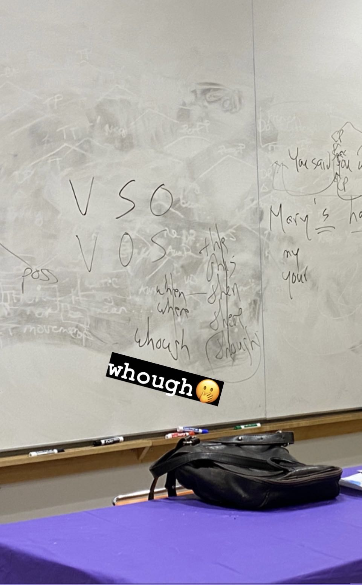

    
  shot in a Syntax II session, 10 Washington Pl, New York
  
  I had been passionate about language(s) since young, but I did not know much about linguistics as a serious science until I took Syntax I (with Stephanie Harves) in my junior year, a course that so enchantingly changed my ways of looking at language(s). I then decided to reoreient my academic pursuit to becoming a lingusit.
  In my spare time, I like also to read 📖, watch films 🎬, do exercise 🏋🏻‍♂️ and citywalk 🚶🏻. I write occasionally some poetry, and if you are curious I can share them with you!

